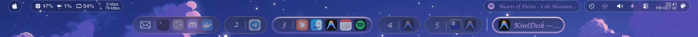

<div align="center">

# dotfiles

### My Mac, reproducible in one command.

**One `./setup.sh` turns a fresh macOS install into my desk:** Homebrew
and every app, a zsh that starts fast, Ghostty, a custom SketchyBar,
and [KiwiDesk](https://github.com/KiwiCanopy/KiwiDesk) tiling it all,
linked into place with GNU Stow.

<br>


[](LICENSE)



</div>

## Quick start

You need the Xcode Command Line Tools (they bring `git`):

```bash
xcode-select --install
```

Then clone and run the setup:

```bash
git clone https://github.com/hajiboy95/dotfiles.git ~/dotfiles
cd ~/dotfiles
./setup.sh
```

The repo has to live at `~/dotfiles`; the setup scripts look for it
there. Every step checks before it acts, so running `./setup.sh` again
is safe: it installs what is missing and re-links what moved.

## What the setup does

`setup.sh` runs `scripts/setup/` in order:

| Step | Script | Does |
|---|---|---|
| 1 | `01-xcode.sh` | Checks for the Command Line Tools and stops with a hint if they are missing |
| 2 | `02-uv-python.sh` | Installs [uv](https://github.com/astral-sh/uv) and the notebook-cleaning tool |
| 3 | `03-homebrew.sh` | Installs Homebrew, then everything in the `Brewfile` |
| 4 | `04-sketchybar.sh` | Builds SbarLua, the Lua bindings the bar is written in |
| 5 | `05-macos-settings.sh` | Mission Control and Spaces defaults (group windows by app, Spaces across displays) |
| 6 | `06-dotfiles.sh` | Installs the pre-commit hooks and links everything into `$HOME` with `stow --restow` |

## What's inside

### SketchyBar: the menu bar, rebuilt in Lua

`.config/sketchybar/` replaces the macOS menu bar with pills that show
only what earns the space:

- **App menus** behind the Apple logo, which slide out on hover.
- **CPU, GPU and RAM** at a glance; click them for live graphs.
- **Network** up/down, **Spotify** (play/pause and skip from the
  bar), **Tailscale** (connect, disconnect, pick an exit node),
  **Bluetooth device batteries** that fold into one glyph, the
  **next calendar event** shortly before it starts, a **pomodoro
  timer**, battery, volume and the clock.
- **Themes** that switch live, with no reload, and repaint KiwiDesk to
  match. The **KiwiDesk** theme reads the active KiwiDesk profile, its
  colours, its font and whether it wears Liquid Glass, so both bars
  look like one desk.

Colour carries state, the same way in every theme: the accent means
on or playing, plain text is information, dimmed is off, and
orange/red needs attention.

Four small helpers in Swift and C read what Lua cannot: the front
app's menus, your calendar, a font's real style names and where the
mouse is inside a popup item. They are
built on load with `make`, so a fresh clone needs no extra step.

### KiwiDesk

`.config/KiwiDesk/init.lua` configures
[KiwiDesk](https://github.com/KiwiCanopy/KiwiDesk), the tiling window
manager that lays out every window. KiwiDesk also brings its own
Space Bar and App Bar, styled to match SketchyBar.

### Shell

- **zsh** (`.zshrc`, `.zshenv`) with completions cached for a day and
  NVM loaded lazily (`.env_power.zsh`), so a new shell opens fast and
  `node` is still there when you call it.
- [Starship](https://starship.rs) prompt, `eza` for `ls`, `bat` for
  `cat`, `zoxide`, `fzf` and `direnv`.
- **Ghostty** (`.config/ghostty`): a quick terminal on
  <kbd>⌃⌘Space</kbd>, slight transparency, Solarized Osaka Night.

### Odds and ends

- **Raycast scripts** (`.config/raycast_scripts`) that send a
  screenshot or the selected text to ChatGPT.
- **Clean notebooks in git**: a global filter (`.gitattributes` +
  `.gitconfig`) strips outputs and metadata from every `.ipynb` as it
  is committed, using nbconvert from the `notebook_cleaning` uv
  project.
- **pre-commit** with ShellCheck, Ruff, StyLua, luacheck and the
  standard hygiene hooks, including private-key detection.

## Keeping it current

**The Brewfile.** After installing or removing apps, regenerate it from
the repo root:

```bash
brew bundle dump --describe --force
```

**The SketchyBar app font icon map.** Now and then, grab the latest
`icon_map.lua` from the
[sketchybar-app-font releases](https://github.com/kvndrsslr/sketchybar-app-font/releases)
and replace `.config/sketchybar/helpers/icon_map.lua`.

**SketchyBar after a change.** Edits reload on save. Running it as a
service starts it at login:

```bash
brew services start sketchybar
```

## After setup

A few things the scripts can't do for you:

- **Accessibility and Calendars.** Allow SketchyBar under System
  Settings ▸ Privacy & Security: Accessibility for the app menus,
  Calendars for the next event. Spotify needs nothing: the bar reads
  and controls it through macOS's Now Playing (`media-control`).
- **Optimized Battery Charging.** If you use a charge limiter such as
  Battery Toolkit, turn it off so the two don't fight: System
  Settings ▸ Battery ▸ ⓘ next to Battery Health.
- **Log out once,** so the Spaces setting takes effect.

## License

[MIT](LICENSE)
